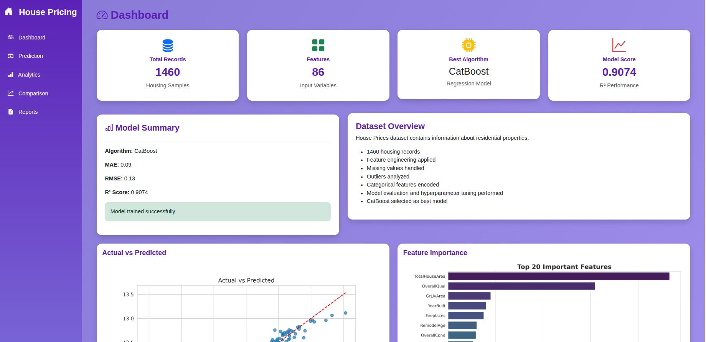
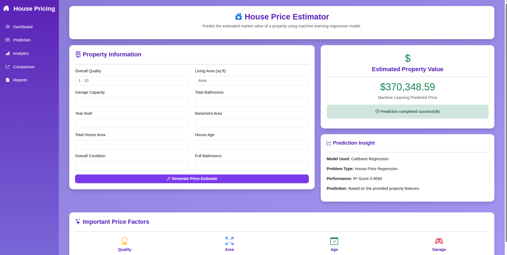
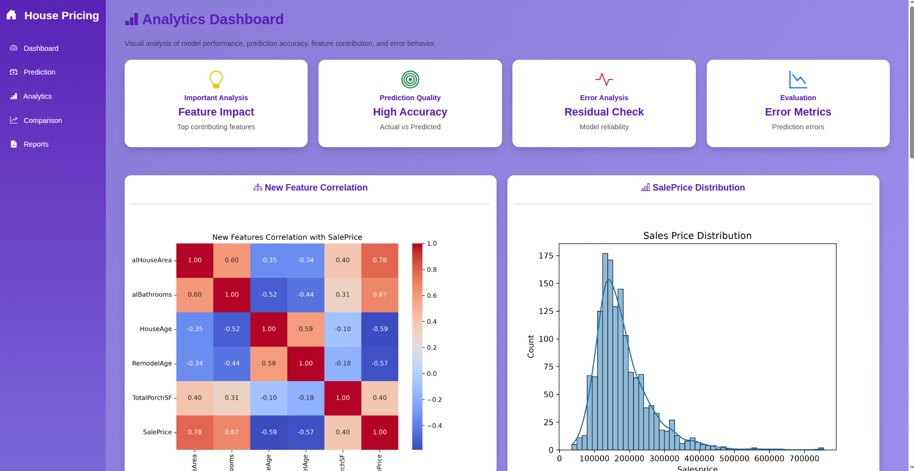
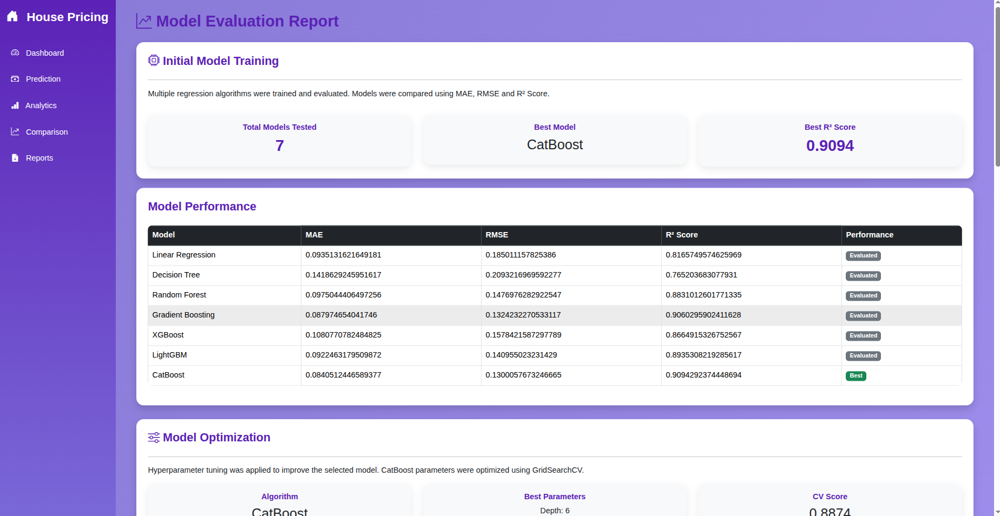
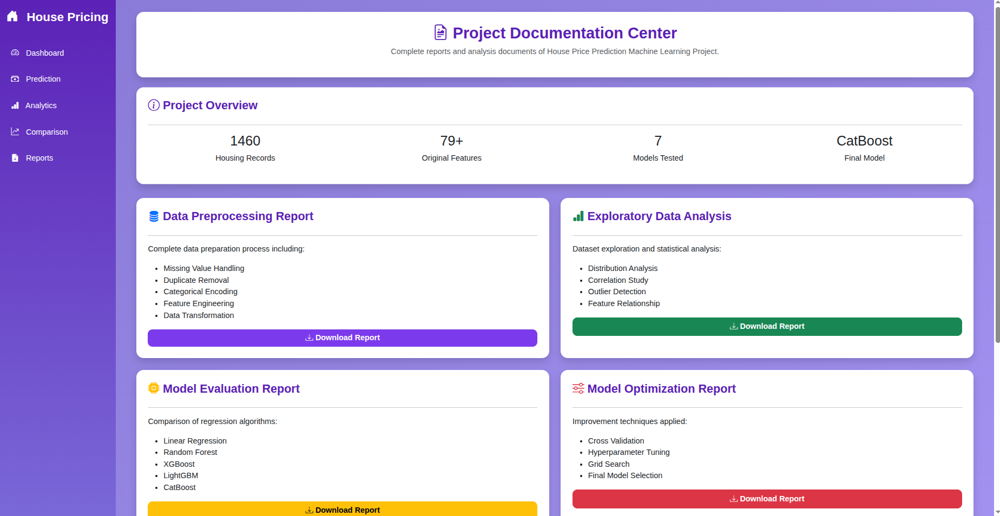

# 🏠 House Price Prediction Using Machine Learning

## 📌 Project Overview

This project predicts house prices using Machine Learning regression algorithms. It includes data preprocessing, feature engineering, exploratory data analysis (EDA), model comparison, hyperparameter tuning, and a Flask web application for real-time house price prediction.

The best-performing model is **CatBoost Regressor**.

---

## 🚀 Features

- Data Cleaning & Preprocessing
- Exploratory Data Analysis (EDA)
- Feature Engineering
- Model Training
- Model Comparison
- Hyperparameter Tuning
- House Price Prediction
- Analytics Dashboard
- Model Comparison Dashboard
- PDF Report Generation
- Responsive Flask Web Application

---

## 🛠 Technologies Used

- Python
- Pandas
- NumPy
- Scikit-learn
- CatBoost
- XGBoost
- LightGBM
- Matplotlib
- Flask
- HTML
- CSS
- Bootstrap 5
- ReportLab
- Git & GitHub

---

## 📂 Project Structure

```text
House_Pricing/

│── app.py
│
├── cleaned/
│   └── cleaned_house_data.csv
│
├── datasets/
│
├── models/
│   ├── model.pkl
│   └── features.pkl
│
├── notebooks/
│   └── house_price.ipynb
│
├── reports/
│   ├── model_results.csv
│   ├── optimized_results.csv
│   ├── Data_Preprocessing_Report.pdf
│   ├── EDA_Report.pdf
│   ├── Model_Comparison_Report.pdf
│   ├── Model_Optimization_Report.pdf
│   └── Prediction_Report.pdf
│
├── static/
│   ├── css/
│   │   └── style.css
│   └── images/
│
├── templates/
│   ├── base.html
│   ├── dashboard.html
│   ├── prediction.html
│   ├── analytics.html
│   ├── comparison.html
│   └── reports.html
│
├── report_generator.py
├── requirements.txt
├── README.md
├── Pipfile
├── Pipfile.lock
└── .gitignore
```

---

## 📊 Machine Learning Models

The following regression models were trained and compared:

- Linear Regression
- Decision Tree Regressor
- Random Forest Regressor
- Gradient Boosting Regressor
- XGBoost Regressor
- LightGBM Regressor
- CatBoost Regressor

**Final Selected Model:** CatBoost Regressor

---

## 📈 Model Evaluation Metrics

- MAE
- RMSE
- R² Score
- Cross Validation
- Hyperparameter Tuning

---

## 🌐 Flask Application

The application contains the following pages:

- Dashboard
- Prediction
- Analytics
- Comparison
- Reports

Users can enter house details and receive an estimated house price. A prediction report is automatically generated in PDF format.

---
---

## 📷 Application Screenshots

### 🏠 Dashboard



---

### 💰 House Price Prediction



---

### 📊 Analytics



---

### 📈 Model Comparison



---

### 📄 Reports



## ▶️ Installation

Clone the repository:

```bash
git clone https://github.com/yourusername/House_Pricing.git
```

Go to the project folder:

```bash
cd House_Pricing
```

Install dependencies:

```bash
pip install -r requirements.txt
```

Run the Flask application:

```bash
python app.py
```

Open your browser:

```
http://127.0.0.1:5000
```

---

## 📄 Reports

The project includes:

- Data Preprocessing Report
- EDA Report
- Model Comparison Report
- Model Optimization Report
- Prediction Report

---

## 👨‍💻 Author

Machine Learning Project using Flask, Bootstrap, and CatBoost Regression.