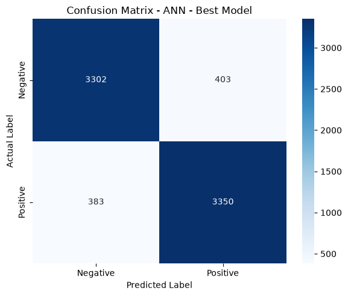
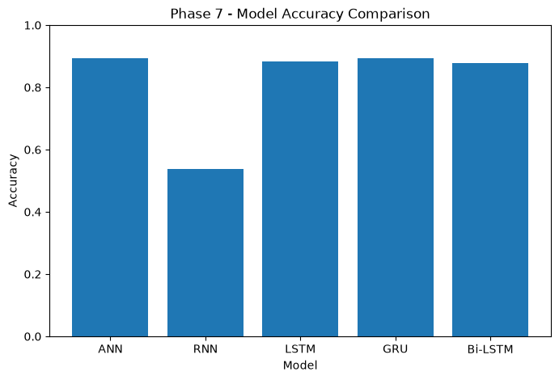
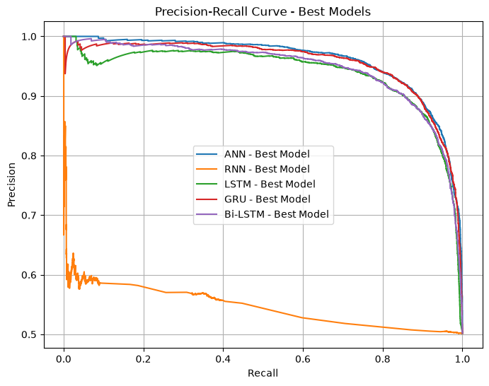
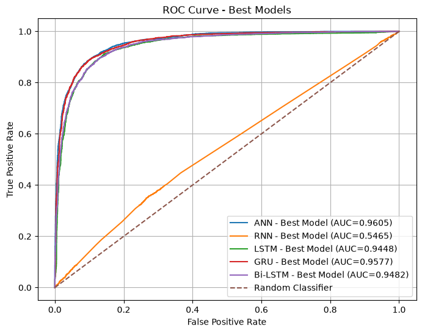
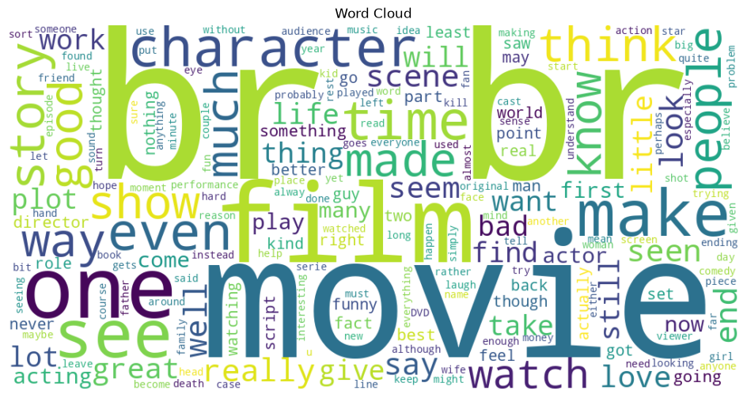
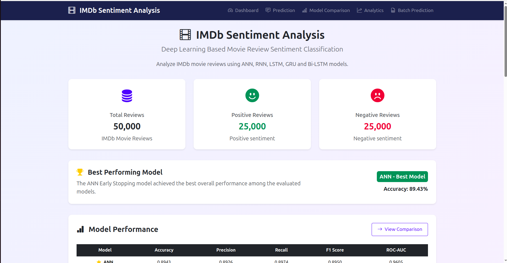
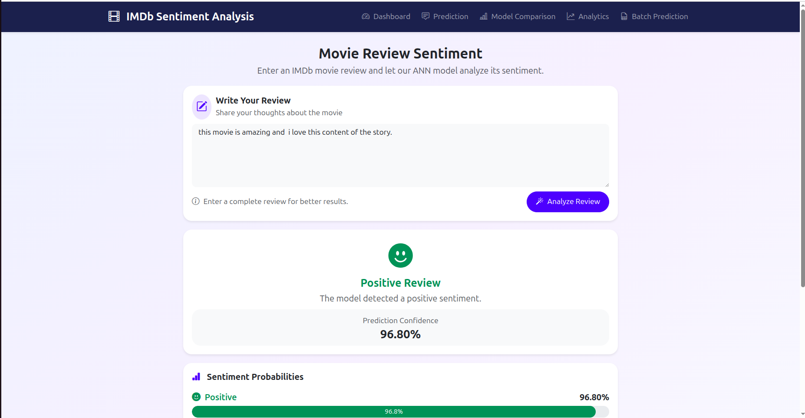
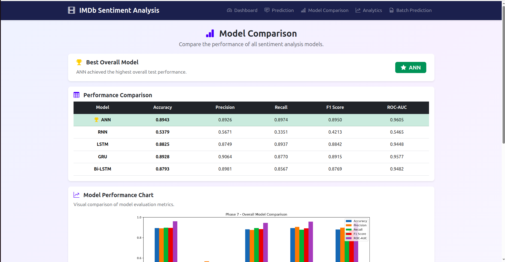
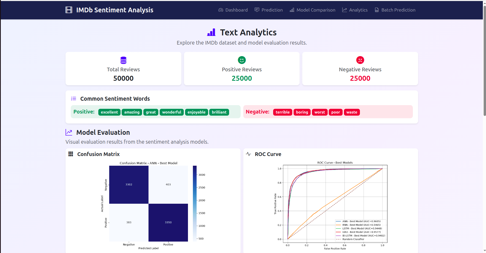
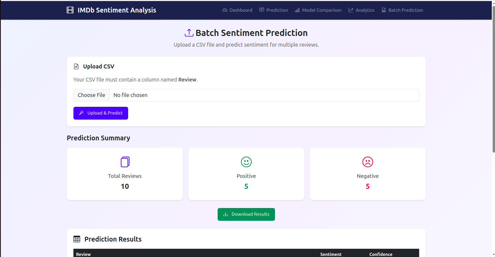

# IMDb Sentiment Analysis

## Project Overview

This project is a **Deep Learning based IMDb Movie Review Sentiment Analysis system**.

The system analyzes movie reviews and predicts whether the sentiment is:

- Positive
- Negative

The project includes data understanding, text preprocessing, feature representation, deep learning models, model optimization, evaluation, model comparison, interpretation, and a Flask web application.

## Dataset

**Dataset:** IMDb Movie Reviews Dataset

- Total reviews: 50,000
- Positive reviews: 25,000
- Negative reviews: 25,000

The project uses movie review text as the input and sentiment as the target.

## Project Workflow

```text
Data Understanding
        ↓
Text Preprocessing
        ↓
Feature Representation
        ↓
Deep Learning Models
        ↓
Model Optimization
        ↓
Model Evaluation
        ↓
Model Comparison
        ↓
Model Interpretation
        ↓
Flask Web Application
```

## Models

The following models were implemented and evaluated:

- ANN
- RNN
- LSTM
- GRU
- Bi-LSTM

## Model Performance

| Model | Accuracy | Precision | Recall | F1 Score | ROC-AUC |
|---|---:|---:|---:|---:|---:|
| ANN - Best Model | 0.8943 | 0.8926 | 0.8974 | 0.8950 | 0.9605 |
| RNN - Best Model | 0.5379 | 0.5671 | 0.3351 | 0.4213 | 0.5465 |
| LSTM - Best Model | 0.8825 | 0.8749 | 0.8937 | 0.8842 | 0.9448 |
| GRU - Best Model | 0.8928 | 0.9064 | 0.8770 | 0.8915 | 0.9577 |
| Bi-LSTM - Best Model | 0.8793 | 0.8981 | 0.8567 | 0.8769 | 0.9482 |

### Selected Model

Based on the final evaluation results, the **ANN Best Model** achieved the highest accuracy and ROC-AUC among the final models:

- Accuracy: **89.43%**
- Precision: **89.26%**
- Recall: **89.74%**
- F1 Score: **89.50%**
- ROC-AUC: **96.05%**

The ANN model used in the Flask application is the optimized model selected during Phase 5.

## Model Evaluation

The project includes:

- Accuracy
- Precision
- Recall
- F1 Score
- ROC-AUC
- Confusion Matrix
- ROC Curve
- Precision-Recall Curve
- Misclassified Reviews
- Model comparison charts

## Text Analytics

The application provides:

- Sentiment distribution
- Review statistics
- Word frequency
- Word cloud
- Model performance information

## Flask Web Application

The Flask application contains the following pages:

### Dashboard

Shows:

- Project overview
- Dataset statistics
- Model performance
- Word cloud

### Sentiment Prediction

Users can:

1. Enter an IMDb movie review.
2. Submit the review.
3. Get Positive or Negative sentiment.
4. View prediction confidence.
5. View positive and negative probabilities.

### Model Comparison

Displays the performance of:

- ANN
- RNN
- LSTM
- GRU
- Bi-LSTM

### Analytics

Displays:

- Dataset statistics
- Sentiment distribution
- Word frequency
- Word cloud
- Evaluation charts

### Batch Prediction

Users can upload a CSV file containing a `Review` column.

The application:

1. Reads the uploaded reviews.
2. Converts reviews using the saved TF-IDF vectorizer.
3. Predicts sentiment using the ANN model.
4. Displays prediction results.
5. Shows confidence.
6. Provides a downloadable CSV file.

## Project Structure

```text
Sentiment_Analysis/
│
├── models/
│   ├── ann_model.keras
│   ├── ann_early_stopping.keras
│   ├── ann_dropout.keras
│   ├── ann_rmsprop.keras
│   ├── ann_batchnorm.keras
│   ├── ann_batchsize.keras
│   ├── ann_hidden_units.keras
│   ├── ann_lr_scheduler.keras
│   ├── ann_learning_rate.keras
│   ├── tfidf_vectorizer.pkl
│   ├── tokenizer.pkl
│   └── other saved model/data files
│
├── notebooks/
│   ├── Data_Understanding.ipynb
│   ├── text_preprocessing.ipynb
│   ├── feature_representation.ipynb
│   ├── phase5_ANN.ipynb
│   ├── phase5_RNN.ipynb
│   ├── phase5_LSTM_1.ipynb
│   ├── phase5_GRU.ipynb
│   ├── phase5_bilstm.ipynb
│   ├── phase6.ipynb
│   └── phase7.ipynb
│
├── static/
│   ├── css/
│   │   └── style.css
│   │
│   ├── images/
│   │   ├── confusion_matrix.png
│   │   ├── evaluation_comparison.png
│   │   ├── model_accuracy_comparison.png
│   │   ├── precision_recall.png
│   │   ├── roc_curve.png
│   │   └── wordcloud.png
│   │
│   └── uploads/
│
├── templates/
│   ├── base.html
│   ├── index.html
│   ├── predict.html
│   ├── comparison.html
│   ├── analytics.html
│   └── batch.html
│
├── app.py
├── requirements.txt
├── Pipfile
├── Pipfile.lock
├── .gitignore
└── README.md
```

## Evaluation Charts

The generated evaluation images are stored in:

```text
static/images/
```

### Confusion Matrix



### Model Evaluation Comparison


### Model Accuracy Comparison



### Precision-Recall Curve



### ROC Curve



### Word Cloud



## Project Structure Screenshots

The screenshots provided with the project show the organization of the notebooks, models, static files, templates, and Flask application.


## Web Application Screenshots

Add screenshots of the actual Flask pages to:

```text
docs/screenshots/
```

Recommended filenames:

```text
dashboard.png
prediction.png
comparison.png
analytics.png
batch_prediction.png
```

Then add them to this section:

```markdown
### Dashboard



### Sentiment Prediction



### Model Comparison



### Analytics



### Batch Prediction


```

## Technologies Used

- Python
- Pandas
- NumPy
- TensorFlow
- Keras
- Scikit-learn
- NLTK
- Matplotlib
- Seaborn
- Flask
- Bootstrap
- Git
- GitHub

## Installation

Create and activate a virtual environment:

```bash
python -m venv venv
source venv/bin/activate
```

Install the required packages:

```bash
pip install -r requirements.txt
```

## Run the Flask Application

From the `Sentiment_Analysis` project folder:

```bash
python app.py
```

Then open the local Flask URL shown in the terminal, normally:

```text
http://127.0.0.1:5000/
```

## Batch Prediction CSV Format

The uploaded CSV must contain a column named:

```text
Review
```

Example:

```csv
Review
"This movie was amazing and enjoyable."
"The movie was boring and disappointing."
"I really enjoyed the acting and story."
```
