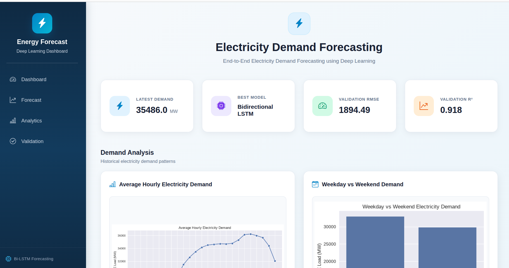
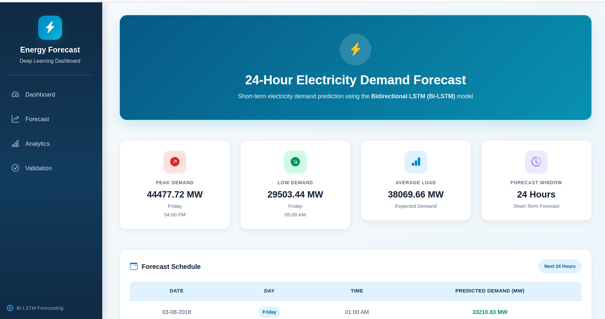
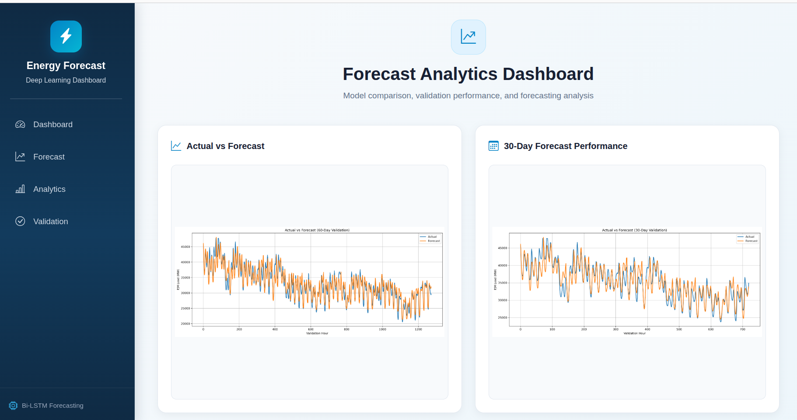
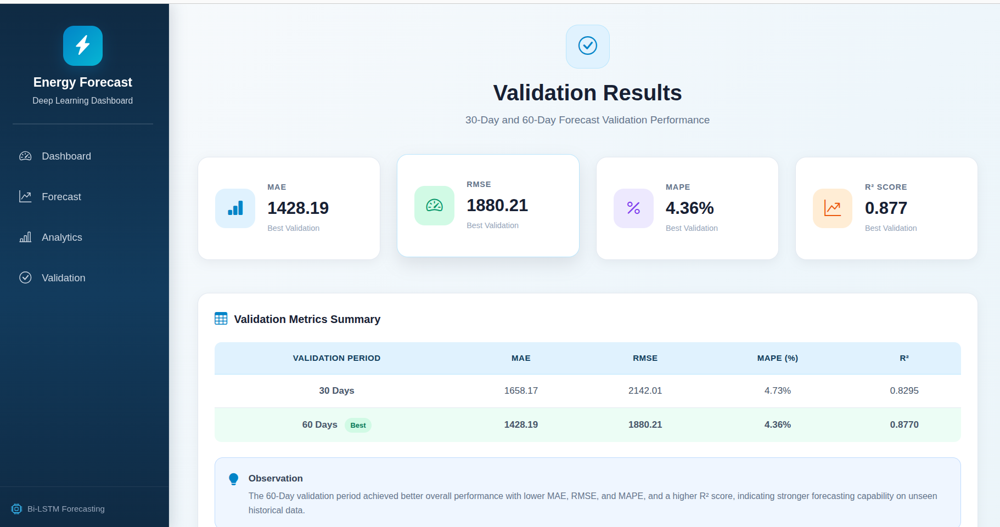

# ⚡ Electricity Demand Forecasting using Deep Learning

An end-to-end **electricity demand forecasting system** developed using **Time-Series Analysis, Deep Learning, and Flask**. The project uses historical **PJM Hourly Energy Consumption** data to predict future electricity demand and provides an interactive web dashboard for forecasting, analytics, and model evaluation.

---

## 📌 Project Overview

The objective of this project is to forecast future electricity demand using historical hourly consumption data.

The project covers the complete workflow from data preprocessing to deployment:

**Data Understanding → Preprocessing → Feature Engineering → EDA → Baseline Models → Deep Learning → Model Improvement → Validation → Flask Deployment**

---

## 🎯 Objectives

- Analyze historical electricity demand patterns.
- Identify trends and seasonal patterns in hourly energy consumption.
- Preprocess and prepare time-series data for deep learning.
- Develop baseline forecasting models.
- Implement multiple deep learning models.
- Compare model performance using multiple evaluation metrics.
- Improve forecasting performance using sequence lengths and feature engineering.
- Validate the final model on unseen future data.
- Deploy the forecasting system using Flask.

---

## 📂 Dataset

- **Dataset:** PJM Hourly Energy Consumption
- **Source:** Kaggle
- **Target Variable:** Electricity Demand (MW)
- **Data Type:** Hourly Time-Series Data
- **Duration:** More than 10 years

The dataset contains historical hourly electricity consumption values used to learn demand patterns and forecast future electricity demand.

---

## 🧠 Models Used

The following forecasting approaches were implemented and compared:

### Baseline Models

- Naive Forecast
- Moving Average
- Previous-Day Forecast
- Previous-Week Forecast

### Deep Learning Models

- RNN
- LSTM
- GRU
- Bidirectional LSTM (Bi-LSTM)

---

## ⚙️ Data Processing

The dataset was processed through several stages:

- Datetime conversion
- Chronological sorting
- Duplicate record detection
- Missing timestamp detection
- Missing value treatment
- Outlier detection
- Outlier capping
- Feature scaling
- Time-based feature engineering
- Lag feature creation
- Rolling statistics

### Features Created

- Hour
- Day
- Week
- Month
- Day of Week
- Weekend
- Lag Features
- Rolling Mean
- Rolling Standard Deviation

---

## 📊 Exploratory Data Analysis

Exploratory analysis was performed to understand electricity demand behavior.

The analysis includes:

- Hourly demand patterns
- Daily demand patterns
- Weekly demand patterns
- Monthly demand trends
- Seasonal behavior
- Demand distribution
- Rolling mean analysis
- Rolling standard deviation
- Correlation analysis
- Peak demand analysis

These visualizations helped identify important temporal patterns before developing the forecasting models.

---

## 🏆 Final Model

The **Bidirectional LSTM (Bi-LSTM)** was selected as the final forecasting model.

| Parameter | Value |
|-----------|-------|
| Model | Bidirectional LSTM |
| Sequence Length | 168 Hours |
| Forecast Horizon | 24 Hours |
| Target | Electricity Demand (MW) |

The **168-hour sequence** represents one week of historical hourly electricity demand.

The model uses the previous week's demand patterns and engineered time-series features to forecast the next 24 hours.

---

## 📈 Model Evaluation

The models were evaluated using the following metrics:

- MAE – Mean Absolute Error
- MSE – Mean Squared Error
- RMSE – Root Mean Squared Error
- MAPE – Mean Absolute Percentage Error
- R² Score – Coefficient of Determination
- Forecast Bias

### Validation Results

| Validation Period | MAE | RMSE | MAPE | R² |
|-------------------|-----:|------:|-----:|----:|
| 30 Days | 1658.17 | 2142.01 | 4.73% | 0.8295 |
| 60 Days | 1428.19 | 1880.21 | 4.36% | 0.8770 |

### Key Result

The model achieved an **R² score of 0.8770** during the 60-day validation period, indicating that the model explains a large portion of the variation in electricity demand.

The 60-day validation also achieved lower MAE, RMSE, and MAPE compared with the 30-day validation period.

---

## 🔬 Forecast Validation

The final model was evaluated on unseen chronological data to measure its real forecasting performance.

Validation experiments include:

- **30-Day Forecast Validation**
- **60-Day Forecast Validation**

The validation process compares:

**Actual Electricity Demand vs Predicted Electricity Demand**

This helps evaluate how well the model performs on future unseen observations.

---

## 🌐 Flask Web Application

The trained forecasting model was integrated into a **Flask-based web application**.

The application provides the following modules:

### 🏠 Dashboard

- Project overview
- Model information
- Forecast summary
- Model comparison
- Performance metrics
- Quick navigation

### 🔮 Forecast

- Future electricity demand prediction
- 24-hour forecast
- Forecasted demand values
- Peak demand information
- Minimum demand information
- Average demand information

### 📊 Analytics

- Actual vs Forecast visualization
- Forecast performance analysis
- Daily forecast error
- Peak demand error
- Baseline model comparison
- Deep learning model comparison
- Improved model comparison

### ✅ Validation

- 30-day validation
- 60-day validation
- Actual vs predicted demand
- Validation performance metrics
- Forecast error analysis

---

## 📸 Application Screenshots

### 🏠 Dashboard



### 🔮 Forecast



### 📊 Analytics



### ✅ Validation



---

## 🔄 Project Workflow

```text
PJM Hourly Dataset
        ↓
Data Understanding
        ↓
Data Preprocessing
        ↓
Feature Engineering
        ↓
Exploratory Data Analysis
        ↓
Baseline Forecasting
        ↓
Deep Learning Models
        ↓
Model Improvement
        ↓
Model Evaluation
        ↓
Forecast Validation
        ↓
Flask Web Application
        ↓
Interactive Dashboard
```

---

## 🛠 Technologies Used

### Programming

- Python

### Data Processing

- Pandas
- NumPy
- Scikit-learn

### Deep Learning

- TensorFlow
- Keras

### Visualization

- Matplotlib
- Seaborn

### Web Development

- Flask
- HTML5
- CSS3
- Bootstrap 5
- Jinja2

### Development Tools

- Jupyter Notebook
- Git
- GitHub

---

## 📁 Project Structure

```text
electricity-forecasting/
│
├── datasets/
│
├── models/
│
├── notebooks/
│
├── static/
│   ├── images/
│   │
│   ├── screenshots/
│   │   ├── dashboard.png
│   │   ├── forecast.png
│   │   ├── analytics.png
│   │   └── validation.png
│   │
│   └── style.css
│
├── templates/
│   ├── base.html
│   ├── dashboard.html
│   ├── forecast.html
│   ├── analytics.html
│   └── validation.html
│
├── app.py
├── requirements.txt
├── Pipfile
├── Pipfile.lock
├── .gitignore
└── README.md
```

---

## ⚙️ Installation

### 1. Clone the Repository

```bash
git clone <repository-url>
```

### 2. Navigate to the Project

```bash
cd electricity-forecasting
```

### 3. Create a Virtual Environment

```bash
python -m venv venv
```

### 4. Activate the Virtual Environment

#### Windows

```bash
venv\Scripts\activate
```

#### Linux / macOS

```bash
source venv/bin/activate
```

### 5. Install Dependencies

```bash
pip install -r requirements.txt
```

---

## ▶️ Run the Application

Run the Flask application:

```bash
python app.py
```

Open the application in your browser:

```text
http://127.0.0.1:5000
```

---

## 📊 Project Results

The project demonstrates that deep learning models can effectively learn temporal patterns from historical electricity demand data.

The final **Bi-LSTM model with a 168-hour sequence length** was selected based on its forecasting performance.

The model provides:

- 24-hour electricity demand forecasting
- Future demand estimation
- Forecast error analysis
- Model performance comparison
- Long-term validation
- Interactive visualization

---

## 💡 Key Findings

- Electricity demand shows strong hourly and weekly patterns.
- Historical lag features provide useful information for forecasting.
- Rolling statistics help capture recent demand behavior.
- Sequence length has an important effect on deep learning forecasting performance.
- Bi-LSTM provided the best overall forecasting performance among the tested deep learning models.
- The 168-hour sequence captures one full week of historical demand patterns.
- The model achieved an **R² of 0.8770** during the 60-day validation period.

